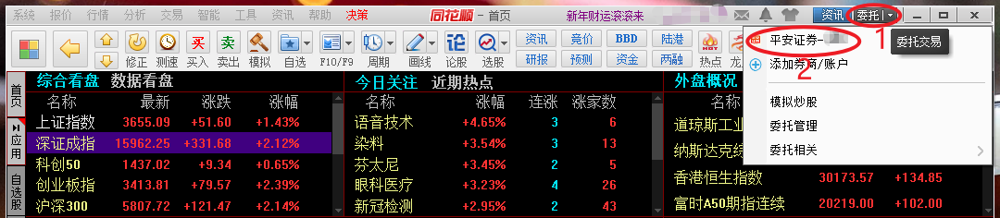
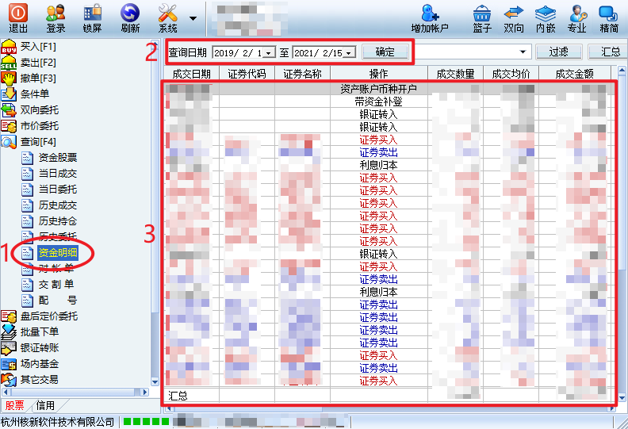
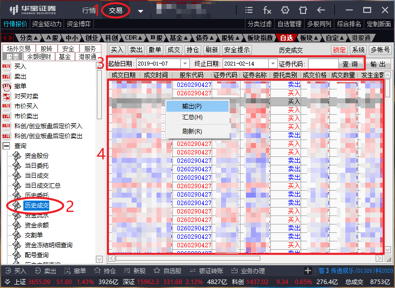

个人资产管理
============

## 个人情况

使用的平台情况

- 使用且慢、蛋卷、微众银行购买过场外基金和其他理财产品
- 使用微众银行、理财通管理现金
- 使用平安证券、华宝证券进行场内投资，主要购买 ETF，也少量购买了股票，同时进行可转债打新

上述平台中，目前在且慢上的资产总额是最高的，并且分账户进行管理，如：

- 跟投长赢指数投资计划（150份），后面简称“长赢150”

  - 账户下包含长赢150的资产和一个货币三佳的资产，初始时就分配好了 150 份资金放在货币三佳里，也就是用货币三佳来管理未投入资金
  - 由于且慢并没有支持直接用账户里的货币三佳来支付，所以买入的时候会从盈米宝扣款，为了维持账户总投入，需要手工从卖出账户里等额的货币三佳到盈米宝
  - 同样，长赢卖出时也是卖出到盈米宝，这个时候需要买入等额的货币三佳

- 跟投长赢指数投资计划（S），后面简称“长赢S”

  - 无初始投入，相当于每发生一笔买入就新增一笔投入
  - 但卖出和长赢150有相同的问题，所以也设立了一个且慢的投资账户，下面包含了长赢S的资产和货币三佳，每当卖出时就买入等额的货币三佳

- U定投，每月选择若干低估指数基金进行定投，该账户与长赢S使用相同的管理方法

除且慢外，在微众上的理财产品都已经赎回，目前只用来管理现金，所以只需要理清历史记录即可；而蛋卷、平安证券、华宝证券等处不像且慢支持分账户的管理和记录，所以我将这三个平台当作三个账户来看待。

总体上来说，我在且慢上的投资相对有计划性，收益率比较好计算，但在其他四个平台上则没什么计划性，仓位不稳定，收益率也就不好计算。

## 对资产管理工具的需求

在此之前使用的是且慢小账本 —— 且慢出品的一个微信小程序，这个工具在用户记录资金转入转出行为和每日（或每周）资产总额的前提下，可以计算收益率和年化收益率，但存在一些问题：

1. 依赖微信平台，无法在 PC 上使用，且无法进行数据的导入导出
2. 需要自己记录资产总额，但其实对某个账户来说，某一时刻的资产总额 = 未投入现金 + 持有资产 x 资产价格，在没有发生交易的情况下，这个是可以自动计算出来的，这种手工记录资产总额的操作过于低效

总结了下我个人对资产管理工具的需求：

1. 能整合我在多个平台多个账户上的交易记录和持有资产
2. 能计算我某个账户的收益和收益率，也能将某几个账户（甚至所有账户）合并起来计算收益和收益率
3. 在整合所有资产的基础上，能进行整体的统计和分析，这里的统计和分析不仅仅指收益率，还可以包括波动率、最大回撤、夏普比率等常见指标，进一步地还可以将所有基金的持仓进行整合来分析持仓分布，可视化展示有的话也很不错
4. 本地化，且比较容易转换为复式记账工具（如 ledger、beancount）支持的格式

上述需求我将会逐步在这个项目中实现。

## 使用说明

### 创建本地数据库

用于存储交易记录等数据

```shell
zs-asset create-db
```

### 导入且慢历史交易记录

- 参考[这里](https://gist.github.com/iwinux/30012ba5e21fba4580b2d2b74b934493)，获得访问且慢 API 需要的 config.json，以及各个资产 ID，货币三佳的不用
- 对每个资产 ID，执行下面的命令导出交易记录

  ```shell
  zs-asset export-qieman --asset-id <资产ID> -c config.json -o <资产名称>.jsonl
  ```

- 使用 `zs-asset parse-qieman` 解析刚才产生的交易记录，输出标准格式的 tsv 文件

  ```shell
  zs-asset parse-qieman -i <资产名称>.jsonl -o <资产名称>.tsv
  ```

  且慢上的交易记录里，红利再投资的记录没有细节，给的日期也是再投资到账的日期，而不是发生这个时间的日期，所以当有红利再投资的记录时，这个命令会尝试根据净值往前推算正确的发生日期，这需要数据库里有对应基金的历史净值数据，如果没有，会输出如下日志

  ```
  can not guess real order time of reinvestment(code: 000147;time: 2021-01-20 00:00:00; nav: 1.10699)
  ```

  此时会使用且慢数据中的到账日期作为交易日期，净值和金额都是有的，只是说这个记录里的净值和交易日期的净值可能会对不上。

  如果想修正交易日期，可以使用 `zs-asset update-fund` 来抓取基金（目前仅支持基金）的历史净值数据

  ```shell
  zs-asset update-fund -c "000147"
  ```

  然后重新跑一次 `zs-asset parse-qieman`，如果看到如下日志输出就说明修正成功了

  ```
  correct reinvestment time of `000147` from `2021-01-20 00:00:00` to  `2021-01-19 00:00:00`(nav diff: 0.00001)
  ```

  此外，对于定投类的账户（如我的长赢S和 U定投），可以加上 `--add-transfer` 选项，这样会每发生一笔买入时，也当作有一笔资金转入，脚本会将同一天的资金转入合并

  对于一次性投入的（如我的长赢150），在输出 tsv 后，需要自己手工在文件中加上一笔资金转入记录，格式为：

  ```
  <账户名>\t<交易时间>\tCASH\t现金\ttransfer_in\t<金额>\t1.0\t<金额>\t<费用>
  ```

  此外，如果像我一样，将未投入资金放在账户下的货币三佳里，它本身也会产生收益，目前没有办法导出它历史上每日的收益，可以添加一条记录来将其到目前为止的累计收益记录起来，格式如下：

  ```
  <账户名>\t<当前时间>\tCASH\t现金\treinvest\t<金额>\t1.0\t<金额>\t<费用>
  ```

  另外需要注意的是，且慢上存在一些红利再投资、分红交易记录丢失的问题，可以用 `zs-asset validate-deals` 来检查是否有这种情况，如果有的话，会得到如下输出：

  ```
  bonus is missing in deals - fund: 易方达上证50增强A(110003), date: 2021-01-18, action: bonus, value: 0.05
  ```

  `zs-asset validate-deals` 要求数据库中有对应基金的分红历史，如果没有可以通过 `zs-asset update-fund` 来获取。

- 使用 `zs-asset import-deals` 将交易记录写入到本地数据库

  ```shell
  zs-asset import-deals -i <资产名称>.tsv
  ```

  该命令支持增量导入，也就是说，我可以在以后发生交易记录的时候自动或手工添加新记录到相应的 tsv 文件然后执行这个命令，已有的交易记录会被忽略，只有新的交易记录才会被写入数据库。

### 导入平安证券历史交易记录

平安证券的 Windows 客户端一次只能查询长度为 366 天的一个时间区间内的交易记录，不太方便，我使用同花顺的 Windows 客户端，在上面登录平安证券的账户，可以导出所有的交易记录（包括银证转账），如下图所示：





在第二张图所示的区域 3，点击鼠标右键，保存为 xls 文件，然后用 Office 软件打开这个 xls 文件，另存为 csv，就可以用 `zs-asset parse-pingan` 进行解析转换为统一格式并写入本地数据库

```shell
zs-asset parse-pingan -i pingan.csv -o pingan.tsv
zs-asset import-deals -i pingan.tsv
```

### 导入华宝证券历史交易记录

我使用华宝证券智投版 Windows 客户端，登录后，按下图中数字序号依次点击得到历史交易记录



然后同样另存为 csv 后进行解析得到统一格式

```shell
zs-asset parse-huabao -i huabao.csv -o huabao.tsv
zs-asset import-deals -i huabao.tsv
```

和平安证券不一样的是，这个导出的记录里不包含银证转账的记录和余额理财（可能是货币基金）的收益记录，这些都得自己手工补上。
